# 開発環境


## Goal

* C++の開発環境の構築方法がわかる。
  * gcc
  * VSCode
  * CMake

## 前提条件

* WSL環境またはUbuntuベースのLinux環境

## 用語説明

### gcc

GNU Compiler Collection
GNUのコンパイラ群

標準パッケージにコンパイラおよびライブラリ群。
C,C++,Objective-C,Objective-C++,Fortran,Ada,Go,Dが含まれている。

### VSCode

Microsoft製ソースコードエディタ
Electronをベースで作られている。
デバッグ、Gitコントロール、シンタックスハイライト、コード補完、
スニペット、コードリファクタリングなどがサポートされている。

### CMake

コンパイラに依存しないビルド自動化のためのソフトウェア


## インストール

### VSCode

https://azure.microsoft.com/ja-jp/products/visual-studio-code/

をダウンロードして、インストールする。

### gcc , cmake

WSLを起動して、下記コマンドを実行する。

```bash
> sudo apt-get install gcc make cmake git clang-format
```


## 動作確認

WSL上で下記コマンドを実行する。

```bash
> code .
```

下記ファイルを作成する。内容は別途参照

```plantuml
@startuml
title ディレクトリ構成図
skinparam TitleFontSize 0

salt

{
  {T
    + root
      ++ src
        +++ main.c
      ++ CMakeLists.txt
  }
}

@enduml
```



## 実行方法

VSCodeでの実行方法は後ほど記載。


以上


