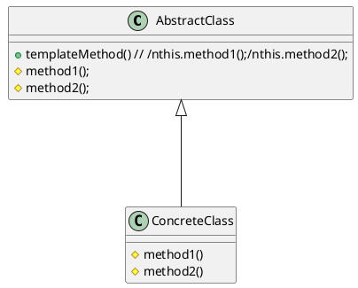
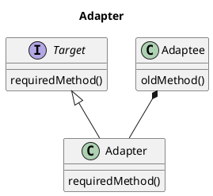

# デザインパターンについて

## 目的

C++の実装を通してデザインパターンを簡単に学ぶ。


## デザインパターンとは

https://ja.wikipedia.org/wiki/%E3%83%87%E3%82%B6%E3%82%A4%E3%83%B3%E3%83%91%E3%82%BF%E3%83%BC%E3%83%B3_(%E3%82%BD%E3%83%95%E3%83%88%E3%82%A6%E3%82%A7%E3%82%A2)


* 設計のノウハウのカタログ
* 一般的に23パターン存在する（物によってはもっとある)
    * 全部使うものではなく、使うものは大体決まっている
* デザインパターンを使うと、設計者で共通コンテキストができるというだけ

デザインパターンを語るうえでポリモーフィズムは必須。
https://ja.wikipedia.org/wiki/%E3%83%9D%E3%83%AA%E3%83%A2%E3%83%BC%E3%83%95%E3%82%A3%E3%82%BA%E3%83%A0

## デザインパターン一覧

主に、生成、構造、振る舞いのパターンに分けて、パターンを定義している。

### 生成に関するパターン

|パターン名     |概要|備考|
|---------------|----|----|
|AbstractFactory|-   |-   |
|Builder        |複合化されたインスタンスの生成過程を隠蔽する   |-   |
|FactoryMethod  | オブジェクト生成をサブクラスに任せることで、クライアントと具象クラスの生成を分離するパターン  |-   |
|Prototype      |-   |-   |
|Signleton      | インスタンスが単一であることを保証する   |-   |


### 構造に関するパターン

|パターン名|概要|備考|
|----------|----|----|
|Adapter   |元々関連性のない2つのクラスを接続するクラスを作る。   |-   |
|Bridge    |-   |-   |
|Decorator |-   |-   |
|Facade    |-   |-   |
|Flyweight |-   |-   |
|Proxy     |-   |-   |

### 振る舞いに関するパターン

|パターン名             |概要|備考|
|-----------------------|----|----|
|Chain of Responsibility|-   |-   |
|Command                |-   |-   |
|Interpreter            |-   |-   |
|Iterator               |-   |-   |
|Mediator               |-   |-   |
|Memento                |-   |-   |
|Observer               |-   |-   |
|State                  |-   |-   |
|Template Method        |あるアルゴリズムの途中経過で必要な処理を抽象メソッドに委ね、その実装を変えることで処理内容を変えられるようにする。   |-   |
|Visitor                |-   |-   |


## Singleton


```plantuml
title Singleton

class Singleton{
    + static Singleton* GetInstance()
    + static Singleton* DestoryInstance()
    - Singleton()
}

```

## Factory

* SimpleFactory
    * 引数で生成するinstanceを切り替える
* Factory
    * クラスで生成するinstanceを切り替える


```plantuml
class Product
class ProductA
class ProductB
Produt <|-- ProductA
Produt <|-- ProductB


class Factory
class FactoryA
class FactoryB

Factory <|-- FactoryA
Factory <|-- FactoryB

FactoryA -> ProductA
FactoryB -> ProductB

class User
User --> Factory:createProduct

```


## AbstractFactory

```plantuml

title AbstractFactory

class AbstractFactory{
    createProductA()
    createProductB()
}
class FactoryA
class FactoryB

AbstractFactory <|-- FactoryA
AbstractFactory <|-- FactoryB

class AbstractProductA
class AbstractProductB

AbstractProductA <|-- ProductA
AbstractProductB <|-- ProductB

Factory -> ProductA
Factory -> ProductB

```

* FactoryMethodとAbstractFactoryの違い
    * FactoryMethod：クラスパターン
    * AbstractFactory:オブジェクトパターン
* FactoryMethod
    * Creatorクラスが子クラスがオブジェクト生成を委ねる
* AbstractFactoryMethod
    * ClientインスタンスがConcreteFactoryのインスタンスにオブジェクトの生成を委ねる


# Buiilder

```plantuml
title ビルダーパターン

class Director
class Builder
class ConcreteBuilder{
    buildPart
    getResult: Product
}
class Product


Director *-- Builder
Builder <|--- ConcreteBuilder
ConcreteBuilder -> Product

```


# Template method





# Adapter



-------------------------------------------


